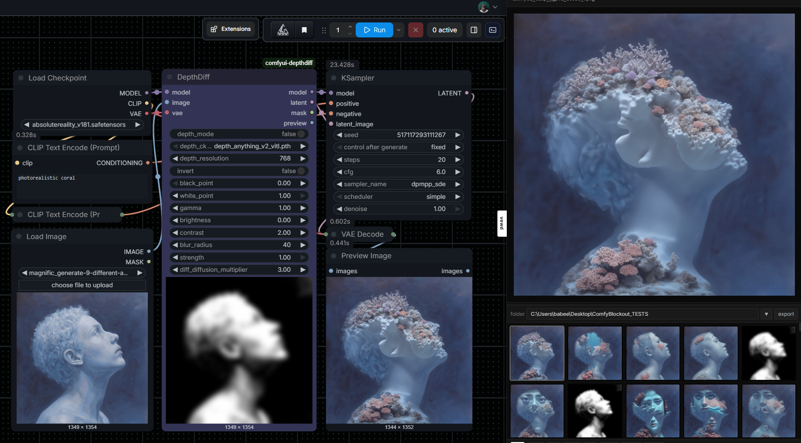

# Comfy-DepthDiff

A single ComfyUI node that turns a source image into a luma/depth-driven **Differential Diffusion** mask — dark regions get more diffusion, light regions get preserved (or vice versa). Bakes in the model patch, VAE encode, and mask preview.



## What it does

Differential Diffusion selectively re-noises regions of a latent based on a grayscale mask. `DepthDiff` builds that mask from your input image — either directly from luma, or by running Depth Anything V2 first — and applies everything (model patch, latent noise mask) in one node.

## Install

**Via ComfyUI Manager (recommended):** search `DepthDiff` and click Install.

**Manual:**

```bash
cd ComfyUI/custom_nodes
git clone https://github.com/spiritform/Comfy-DepthDiff.git
```

Restart ComfyUI.

## Dependencies

Core node has **no external Python dependencies** — works out of the box.

**Optional (only needed for `depth_mode`):**
- [Kijai's `comfyui-depthanythingv2`](https://github.com/kijai/ComfyUI-DepthAnythingV2) must be installed (via ComfyUI Manager or manual clone).
- Depth Anything V2 safetensors weights auto-download to `ComfyUI/models/depthanything/` from [Kijai/DepthAnythingV2-safetensors](https://huggingface.co/Kijai/DepthAnythingV2-safetensors) on first use.

If `depth_mode` is off, feed a pre-computed depth or luma map into the `image` input directly and neither is required.

## Inputs

- `model` — MODEL (patched with Differential Diffusion internally)
- `image` — IMAGE (encoded to latent internally; also the mask source)
- `vae` — VAE (used for the internal encode)

**Widgets:**
- `depth_mode` — if on, runs Depth Anything V2 (Kijai) on the image before extracting luma
- `depth_ckpt` — which Depth Anything V2 safetensors checkpoint to use
- `invert` — flip the mask (default true; dark = more diffusion)
- `black_point` / `white_point` — levels remap
- `gamma`, `brightness`, `contrast` — tone shaping
- `blur_radius` — edge softness
- `strength` — per-pixel clip on the final mask
- `diff_diffusion_multiplier` — global multiplier on when the mask triggers denoising during sampling (1.0 = default, >1 = more aggressive, <1 = more preservation)

## Outputs

- `model` — patched MODEL → KSampler
- `latent` — LATENT with `noise_mask` attached → KSampler
- `mask` — MASK output for downstream use
- `preview` — IMAGE preview of the final mask (also rendered inline on the node)

## Wiring

```
Load Image ─┐
            ├─► DepthDiff ─► model ─► KSampler
Checkpoint ─┤              ─► latent ─┘
    └── VAE ┘
```

## License

MIT
